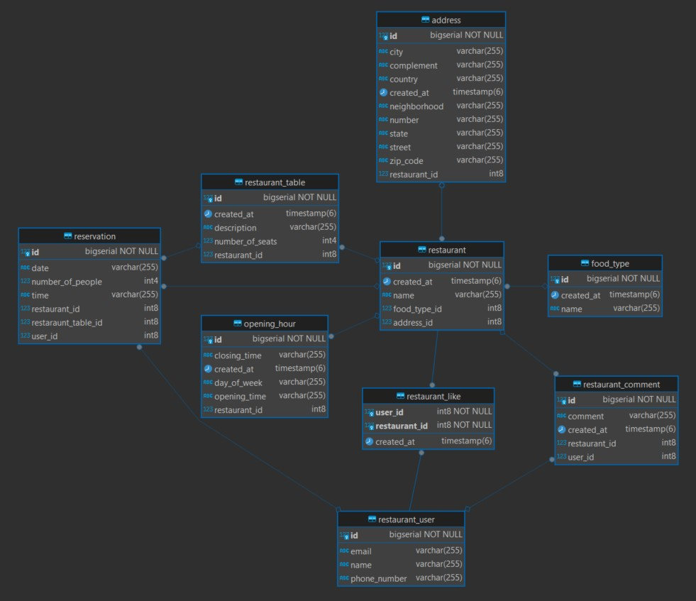

# ⭐ FIAP - Pós Tech (Fase 3) - **Sistema de Reservas e Avaliação de Restaurantes**

---

## 💥 Descrição:

- O projeto "Gestão de Restaurantes" foi criado como critério de avaliação na 3ª fase da pós tech FIAP.

## 🛠️ Funcionalidades:

- **Cadastro de Restaurantes**

  - Os donos de restaurantes irão cadastrar os seus estabelecimentos nessa 
  opção informando o nome, localização, tipo de cozinha, horários de funcionamento e capacidade.
  

- **Reserva de Mesas**
  - Quando o cliente achar o restaurante ele pode fazer uma reserva para um dia e hora
     específica desde que a capacidade do restaurante não tenha atingido o máximo para aquela
     data e hora.    

  
- **Avaliações e Comentários**
  - Após a visita, o cliente pode avaliar o restaurante com uma nota de "um a cinco" e deixar comentários sobre sua experiência.

- **Gerenciamento de Reservas**
  - Os restaurantes podem gerenciar as reservas, visualizando e atualizando o status das
      mesas.

## 🚀 Sobre a Aplicação

- **Desenvolvida utilizando boas práticas de “Clean code”, com arquitetura hexagonal aplicada;**
- **Cobertura de testes unitários e testes integrados;**
- **Testes de carga;**
- **Deploy na nuvem, realizado na plataforma Heroku.**

## 🛠️ Repositório
- ####  https://github.com/brunolimadev/restaurant-management

## 💥Hospedagem

- **Plataforma de Hospedgem: Heroku (Aplicação e Banco de Dados)** https://www.heroku.com/
- **URL do Projeto:** https://fiap-restaurant-management-9269febe02fa.herokuapp.com/restaurant-management/api

## 🚀 Tecnologias Utilizadas

- **Spring Boot:** versão 3.2.2
- **Java:** versão 17
- **PostgreSQL**
- **H2 Database (Testes)**
- **Springdoc-openapi-Swagger** versão 2.3.0
- **Lombok**  versão 1.18.30
- **JUnit** versão: 5.10.1
- **Cucumber** versão 7.15.0 

## 🛠️ Ferramentas Utilizadas

- [GitHub](https://github.com/)
- [IntelliJ IDEA](https://www.jetbrains.com/idea/)
- [Postman](https://www.postman.com/)
- [Draw.io](https://app.diagrams.net/)
- [Dbeaver](https://dbeaver.io/download/)

## 📋 Diagrama ER

## 📋 Swagger

- https://fiap-restaurant-management-9269febe02fa.herokuapp.com/restaurant-management/api/swagger-ui/index.html#

## 😎 Collection para testes
- [fiap_restaurants.postman_collection.zip](https://github.com/brunolimadev/restaurant-management/blob/a486668a0eb26751568bd2191de6cc93a629d773/src/test/resources/collections/fiap_restaurants.postman_collection.zip?raw=true)

## ⭐ Squad

-   GRUPO 57

- **Bruno Rafael de Lima da Rocha**
- **Eric Leonardo Santos Rangel**
- **Wiliam Nascimento da Silva**
- **Lucas Aparecido da Silva Mantovani**

